# Acrobot Using Q-Learning

In this blog post, I'll walk through my approach to solving the [Acrobot](https://gymnasium.farama.org/environments/classic_replay/acrobot/) problem using [Q-Learning](https://huggingface.co/learn/deep-rl-course/unit2/q-learning). Q-Learning is best suited for **discrete state spaces**, meaning it does not directly handle continuous observations. Because of this, applying Q-Learning to this environment requires modifying or approximating the state space into a discrete form.

Before getting into how I handled that, let's first take a quick look at the problem itself, along with its observation and action spaces.

## Quick discussion of the problem statement

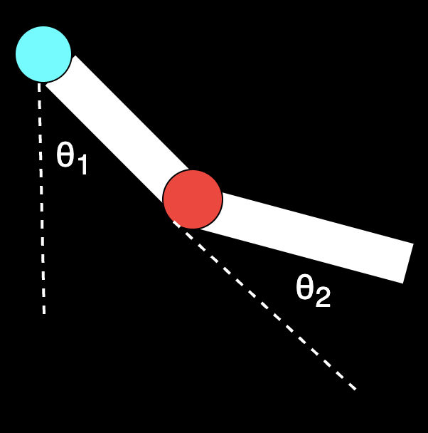

<p style="text-align: center;"><em>&theta; (theta) representation for the system.</em></p>

The Acrobot is essentially a 2-link pendulum, where only the second joint(red-one) is actuated. The objective is to swing the system such that the tip of the second link reaches (or exceeds) a target height. In our problem the height condition should satisfys <code> -cos(&theta;<sub>1</sub>) -cos(&theta;<sub>1</sub> + &theta;<sub>2</sub>) > 1 </code>. 

The angles <code>&theta;<sub>1</sub></code> and <code>&theta;<sub>2</sub></code> represent the relative orientations of the two links, as shown in the figure. Instead of directly observing these angles, the environment provides <code>sin(&theta;<sub>1</sub>)</code>, <code>cos(&theta;<sub>1</sub>)</code>, <code>sin(&theta;<sub>2</sub>)</code>, and <code>cos(&theta;<sub>2</sub>)</code>. These four values uniquely encode the angular positions while avoiding discontinuities.

In addition to this, we also observe the angular velocities of both joints. Altogether, this gives us a **6-dimensional observation vector**, which fully describes the state of the system at any given time.

The action space in this environment is discrete, consisting of three possible actions applied to the actuated joint (highlighted in red):

* Apply negative torque `(0)`
* Apply no torque `(1)`
* Apply positive torque `(2)`


## Back to the solution discussion and thought process

Now that we've clearly discussed the problem state-action values and gotten that out of the way, let's dive back into my solution. In this attempt at discretization, I've chosen to use naive discretization rather than coarse tiling.

> In my very initial attempt, I completely overlooked the number of state-action values and went with extremely fine binning. Later, it turned out to be a blunder, and I remember thinking - how did I miss this? My binning size was `445 x 445 x 500 x 500 ~ 4 x 10^10`, which is about **40 billion state-action values**. Completely unrealistic, once I thought about it properly.

To address this, I realized I don't actually need very fine binning for the angles (positions of the rods) or their angular velocities.

Even if I used extremely fine bins, I wouldn't be able to visit all possible states anyway. That would require training data covering all 40 billion states, which is practically impossible to collect. On top of that, there's the memory overhead of maintaining such a massive Q-table - although that part could be mitigated with careful memory management, the state explosion itself is the real bottleneck.

So, going back to designing a better binning strategy - from observation, I noticed that most of the time the rods tend to stay in the hanging position, since that's the natural resting state of the environment. Pushing the rods above the first joint is comparatively harder.

This means I need finer control in the upper half of the state space. To keep the parameter count manageable, I decided to cap the number of bins at 11 for angular position. The diagram below illustrates this binning scheme.

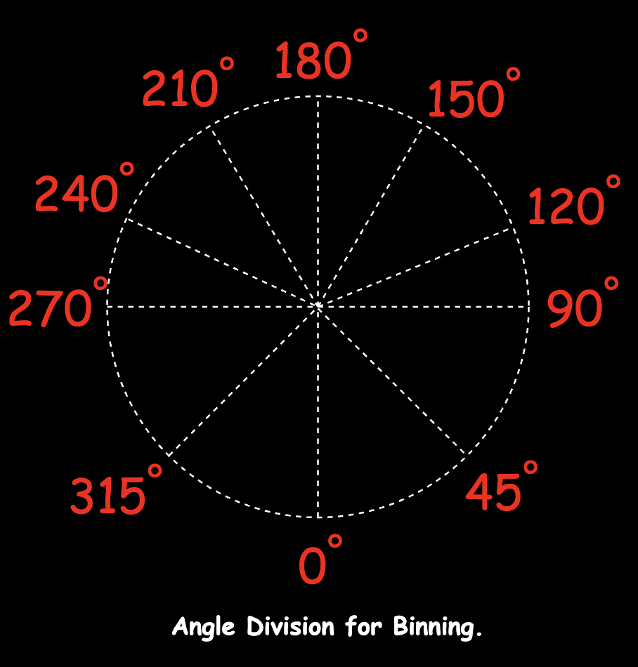

There are **6 bins in the upper half** of the space and **5 bins in the lower half**. This scheme, I think, favors &theta;<sub>1</sub> more and doesn't give as much attention to &theta;<sub>2</sub> (which is the relative angle with respect to the first rod).


> ### A small but important detail about angle representation
>
> One subtle (but quite important) design choice here is that I'm <b>not directly binning the angle &theta;</b>. Instead, I'm working with its <b>cosine and sine values</b>.
>
> The main reason for this is to avoid the discontinuity at the wrap-around point. Angles like <code>&theta;&deg;</code> and <code>360&deg;</code> represent the exact same physical orientation, but numerically they lie at opposite ends of the range.
> 
> If I were binning angles directly:
> 
> * <code>359&deg;</code> would fall into the **last bin**
> * <code>1&deg;</code> would fall into the **first bin**
> 
> Even though these two states are almost identical, the model would treat them as completely different. This creates an **artificial jump in the state space**, which doesn't reflect the actual physics of the system.
> 
> By representing the angle as <code>(cos &theta;, sin &theta;)</code>, I'm effectively mapping it onto a point on the **unit circle** instead of a linear scale.
> 
> What this does in practice is:
> 
> * there's **no abrupt jump** at <code>&theta;&deg; / 360&deg;</code> - the representation wraps around smoothly
> * angles that are close in reality (like <code>359&deg;</code> and <code>1&deg;</code>) also stay **close in representation**
> * the overall state space becomes **continuous**, which makes learning more stable
> 
> So instead of thinking of angle as a line from <code>&theta; &rarr; 360&deg;</code>, I'm treating it like a **circle**, which is what it actually is. However, this comes with a trade-off.
>
>Since I'm discretizing **cosine and sine separately**, recovering the final bin index is not straightforward. The approach I took was to find the **intersection of the bins** obtained from `cosine` and `sine`, and use that as the final position bin.
>
>That was the idea, at least.
>
>In practice, during testing, I ran into cases where-due to small numerical errors or noise in observation-the cosine and sine values would land in bins that **don't overlap at all**. In those cases, there's no valid intersection, and we effectively end up with *no bin*.
>
>To handle this, I added a [fallback](#fallback-logic):
>instead of intersection, I take the **union of the candidate bins** and use their average as an approximation.
>
>It's not perfect, but it works well enough in practice and keeps the system stable.
>
>So yes, this adds a bit of complexity to the implementation-but overall, it gives a much more **consistent and physically meaningful representation of angles**, which is worth the trade-off here.
>

<br>

> <br>
> That said, this fallback is admittedly a bit of a hack.
>
> The main issue is that it doesn't have a strong geometric grounding - averaging bin indices is more of a <b>practical approximation</b> than a principled solution. It works well enough to keep the system stable, but it's not guaranteed to map to the "closest" physical orientation.
>
> A more natural alternative here would be to treat <code>(cos &theta;, sin &theta;)</code> as a point in 2D space and assign bins based on <b>distance on the unit circle</b>. That would preserve the geometry more faithfully and avoid these edge cases altogether.
>
> Another option I considered was reconstructing the angle using:
>
> <code>&theta; = atan2(sin &theta;, cos &theta;)</code>
>
> and then performing binning directly in angle space. This would eliminate the need for intersection logic entirely, while still preserving continuity at the wrap-around boundary.
>
> I chose not to go that route mainly to stay consistent with the environment's representation and avoid introducing another transformation step into the pipeline.
>
> In hindsight, though, this is probably a cleaner approach — and something I'd revisit in a more refined version of this solution.<br>
>


For angular velocity, I followed a similar observation: lower velocities require finer binning. At low angular velocities, small changes can significantly affect the system's behavior. In contrast, at high angular velocities, it's much harder to alter the trajectory, so less granularity is sufficient.

Another detail I considered is that there's practically no difference between angular velocities like `-0.001` and `0.001`. So, I introduced a **neutral bin around zero** to handle such cases.

> Below is the binning scheme for angular velocity for both rods in the system.

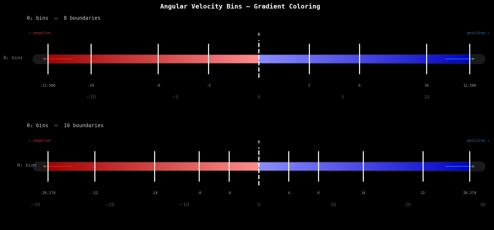

With this setup, we end up with **7 bins** for one rod and **9 bins** for the other in terms of angular velocity.

> So, the total number of states due to my discritization in this problems is: 11 x 11 x 7 x 9 = 7,623 states, and since each state has 3 possible actions, the total number of entries in the Q-table becomes: 11 x 11 x 7 x 9 x 3 = 22,869 state-action values.

This is still orders of magnitude smaller than my initial design, which had around 40 billion state-action values.

This is *orders of magnitude* smaller than my initial design, which had around 40 billion state-action values. With this revised setup, the experiment becomes tractable, and I can realistically train the model using Q-learning.

Below is my Binning code that we use for the binning of the velocity and position for the 2 rods.

<a id="fallback-logic"></a>

```python

class Binning:

    def __init__(self):
        # --- Angle discretization (in degrees) ---
        angle_boundaries = [0, 45, 90, 120, 150, 180, 210, 240, 270, 315, 360, 0]

        # Convert to cosine and sine space
        self.cos_bins = [np.cos(math.radians(a)) for a in angle_boundaries]
        self.sin_bins = [np.sin(math.radians(a)) for a in angle_boundaries]

        # --- Angular velocity configuration ---
        theta1_limit = math.pi * 4
        theta2_limit = math.pi * 9

        self.theta1_velocity_bins = self._generate_velocity_bins(
            base=3, increment=1, limit=theta1_limit
        )
        self.theta2_velocity_bins = self._generate_velocity_bins(
            base=4, increment=2, limit=theta2_limit
        )

        self.velocity_bin_map = {
            "theta1": self.theta1_velocity_bins,
            "theta2": self.theta2_velocity_bins,
        }

        # --- Bin counts (edges - 1 = actual bins) ---
        self.n_angle_bins = len(self.cos_bins) - 1
        self.n_theta1_bins = len(self.theta1_velocity_bins) - 1
        self.n_theta2_bins = len(self.theta2_velocity_bins) - 1

    def _generate_velocity_bins(self, base: float, increment: float, limit: float) -> List[float]:
        """
        Generate symmetric, non-uniform velocity bins around zero.
        """
        bins = []
        current = base

        while current < limit:
            bins.extend([current, -current])
            current += base
            base += increment

        bins.extend([limit, -limit])
        return sorted(bins)

    def _in_bin(self, left: float, right: float, value: float) -> bool:
        """
        Check if value lies within a bin interval.
        Handles both increasing and decreasing intervals.
        """
        if left <= right:
            return left <= value < right
        return right < value <= left

    def _find_bin_indices(self, boundaries: List[float], value: float) -> List[int]:
        """
        Return all bin indices where the value fits.
        """
        return [
            i
            for i in range(len(boundaries) - 1)
            if self._in_bin(boundaries[i], boundaries[i + 1], value)
        ]

    def position(self, pos: tuple[float, float]) -> int:
        """
        Determine position bin using (cos θ, sin θ).
        """
        cos_val, sin_val = pos

        cos_bins = self._find_bin_indices(self.cos_bins, cos_val)
        sin_bins = self._find_bin_indices(self.sin_bins, sin_val)

        # Ideal case: intersection exists
        common_bins = list(set(cos_bins) & set(sin_bins))
        if common_bins:
            return common_bins[0]

        # Fallback: approximate using union
        candidate_bins = set(cos_bins) | set(sin_bins)
        if not candidate_bins:
            return 0

        return math.ceil(math.fsum(candidate_bins) / len(candidate_bins))

    def angular_velocity(self, value: float, key: Literal["theta1", "theta2"]) -> int:
        """
        Determine angular velocity bin.
        """
        bins = self.velocity_bin_map[key]
        indices = self._find_bin_indices(bins, value)

        if indices:
            return indices[0]

        # Handle out-of-bound values
        if value <= bins[0]:
            return 0
        return len(bins) - 2
```
<p style="text-align: center;"><i>Modified code for better readiblity</i></p>

## Q-table, update logic, and action selection

Similarly, below is the implementation of the **Q-table**, along with the **update rule** and **action selection strategy**.

The idea here is fairly straightforward:
once we have a discretized state space, we can store and update Q-values using a fixed-size table instead of a dynamically growing structure like a dictionary.

```python

class Policy:

    def __init__(
        self,
        action_space: int,
        learning_rate: float = 0.1,
        discount_factor: float = 0.99,
    ):
        self.action_space = action_space
        self.learning_rate = learning_rate
        self.discount_factor = discount_factor

        # Discretizer
        self.binner = Binning()

        # --- Q-table initialization ---
        # Shape:
        # (θ1_pos_bins, θ2_pos_bins, θ1_vel_bins, θ2_vel_bins, actions)
        self.q_table = np.zeros(
            (
                self.binner.n_angle_bins,
                self.binner.n_angle_bins,
                self.binner.n_theta1_bins,
                self.binner.n_theta2_bins,
                self.action_space,
            ),
            dtype=np.float32,
        )

    def discretize_state(
        self, state: Tuple[float, float, float, float, float, float]
    ) -> Tuple[int, int, int, int]:
        """
        Convert continuous state into discrete bin indices.
        State format:
        (cosθ1, sinθ1, cosθ2, sinθ2, θ1_dot, θ2_dot)
        """
        theta1_pos = self.binner.position((state[0], state[1]))
        theta2_pos = self.binner.position((state[2], state[3]))

        theta1_vel = self.binner.angular_velocity(state[4], "theta1")
        theta2_vel = self.binner.angular_velocity(state[5], "theta2")

        return (theta1_pos, theta2_pos, theta1_vel, theta2_vel)

    def update(
        self,
        state: Tuple[int, int, int, int],
        action: int,
        reward: float,
        next_state: Tuple[int, int, int, int],
    ) -> float:
        """
        Apply the Q-learning update rule:
        Q(s, a) ← Q(s, a) + α [r + γ max_a' Q(s', a') - Q(s, a)]
        """
        current_q = self.q_table[state][action]
        best_next_q = float(self.q_table[next_state].max())

        td_target = reward + self.discount_factor * best_next_q
        td_error = td_target - float(current_q)

        self.q_table[state][action] += self.learning_rate * td_error

        return td_error


    def epsilon_greedy(self, state: Tuple[int, int, int, int], epsilon: float) -> int:
        """
        With probability ε: explore (random action)
        With probability 1-ε: exploit (best known action)
        """
        if np.random.rand() < epsilon:
            return np.random.randint(self.action_space)

        return int(np.argmax(self.q_table[state]))

    def act(self, observation: Tuple) -> int:
        """
        Greedy action selection (used during evaluation).
        """
        state = self.discretize_state(observation)
        return int(np.argmax(self.q_table[state]))
    
```
<p style="text-align: center;"><i>Modified code for better readiblity</i></p>

## Training the model

Now that the conceptual implementation is in place and translated into code, I trained the model for **50,000 episodes**, with each episode capped at **500 steps** (the environment's episode limit).

```python
def training_step(self, max_episode_steps: int) -> None:
    """
        Traning code.
    """
    pbar = tqdm(
        range(self.num_episodes),
        desc="training",
        unit="ep",
        dynamic_ncols=True,
    )

    for episode in pbar:
        obs, _ = self.environment.reset()

        episode_reward = 0.0
        episode_length = 0

        for _ in range(max_episode_steps):
            # --- Action selection ---
            state = self.policy.discretize_state(obs)
            action = self.policy.epsilon_greedy(state, self.epsilon)

            # --- Environment step ---
            next_obs, reward, terminated, truncated, _ = self.environment.step(action)

            # --- Bookkeeping ---
            episode_reward += reward
            episode_length += 1

            # --- Learning update ---
            next_state = self.policy.discretize_state(next_obs)
            td_error = self.policy.update(
                state=state,
                action=action,
                reward=reward,
                next_state=next_state,
            )
            self.tracer.log_step(td_error)

            obs = next_obs

            if terminated or truncated:
                break

        # --- Epsilon decay ---
        self.epsilon = max(self.epsilon_end, self.epsilon * self.epsilon_decay)

        # --- Episode logging ---
        metrics = self.tracer.log_episode(
            episode=episode,
            reward=episode_reward,
            length=episode_length,
            epsilon=self.epsilon,
            q_table=self.policy.q_table,
            policy=self.policy,
        )
        pbar.set_postfix(metrics)

        # --- Snapshot Q-table ---
        if (episode + 1) % self.tracer.snapshot_every == 0:
            self.tracer.snapshot(self.policy.q_table, episode + 1)

        # --- Early stopping ---
        if self.tracer.has_converged(threshold=self.early_stop_delta):
            self.logger.warning(
                "Early stop at ep=%d (convergence Δ < %.1e)",
                episode + 1,
                self.early_stop_delta,
            )
            tqdm.write(f"[early stop] converged at episode {episode + 1}")
            break

    # --- Cleanup ---
    self.environment.close()
    self._summarise()
```
<p style="text-align: center;"><i>Modified code for better readiblity</i></p>

><br>
> I’m using an <b>exponential epsilon decay</b> during training:
>
> <code>self.epsilon = max(self.epsilon_end, self.epsilon * self.epsilon_decay)</code>
>
> For this run, I used the following hyperparameters:
>
> <code>
> epsilon_start = 1.0<br>
> epsilon_end = 0.05<br>
> epsilon_decay = 0.995
> </code>
>
> This means epsilon decays **multiplicatively each episode**, dropping quickly in the beginning and then slowly tapering off as it approaches the minimum value.
>
> In practice, this results in **rapid exploration early on**, followed by a fairly quick shift toward exploitation. As seen in the training plots, epsilon reaches its minimum within the first few thousand episodes and stays there for the rest of training.
>
> In hindsight, this decay is **quite aggressive**. While it helps the agent stabilize faster, it also means the model may stop exploring too early and settle into a suboptimal policy.
>
> This is something I’d likely revisit — either by slowing down the decay or using a schedule that maintains exploration for longer.<br>
>

Below are some key plots from the training process.

### Training observations

#### Episode Reward

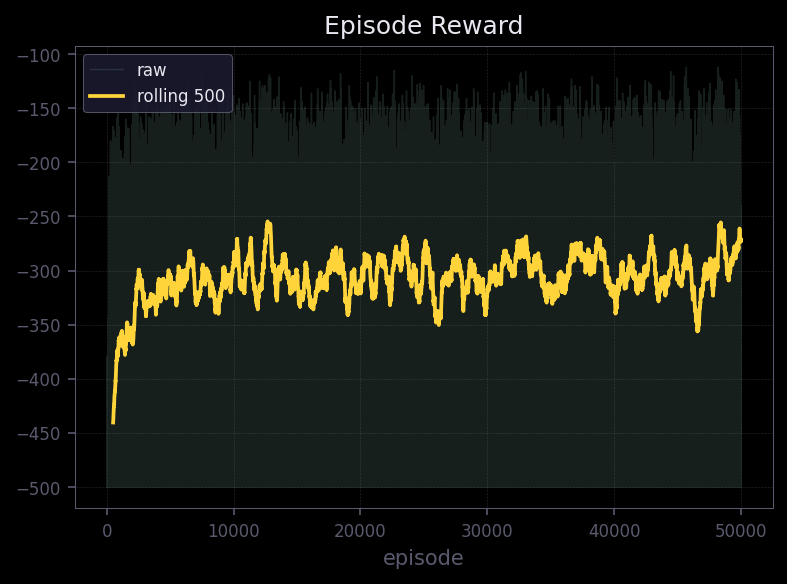

- The raw per-episode rewards are extremely noisy, which is expected in reinforcement learning - stochastic exploration naturally produces high variance trajectories.
- The rolling average (window = 500) tells a cleaner story: a clear upward trend is visible throughout training.
- The agent starts near -450 (essentially failing every episode) and gradually improves toward -270 to -280 by episode 50,000.
- Notably, the rolling average has not plateaued - it is still trending upward at the end of training - which suggests the agent hasn't fully converged and would likely benefit from additional episodes.
- This overall trajectory indicates the agent is learning progressively better control policies, even if the improvement is slow and noisy.

#### Exploration Signals (Entropy & &epsilon;)

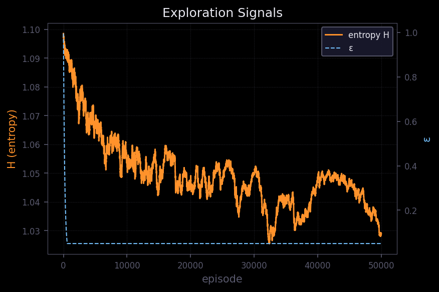

- The exploration rate &epsilon; decays almost immediately - within the first few thousand episodes it drops to its minimum and remains flat for the rest of training. This is quite aggressive decay; if the environment is complex, this could prematurely lock the agent into a suboptimal policy.

- The policy entropy H tells a complementary story and is arguably more informative here. It decreases gradually from ~1.09 &rarr; ~1.03 over 50,000 episodes.

- Early on &rarr; high entropy &rarr; more random, exploratory action selection.
Later &rarr; lower entropy &rarr; more confident, deterministic behavior.

- It's worth noting that the maximum possible entropy for a 3-action discrete space is log(3) ~  1.099, which matches the starting value - confirming the agent begins with a near-uniform policy.
- The slow, steady entropy decline is a healthy sign: the policy is stabilizing gradually without collapsing prematurely.

#### Q-value Evolution

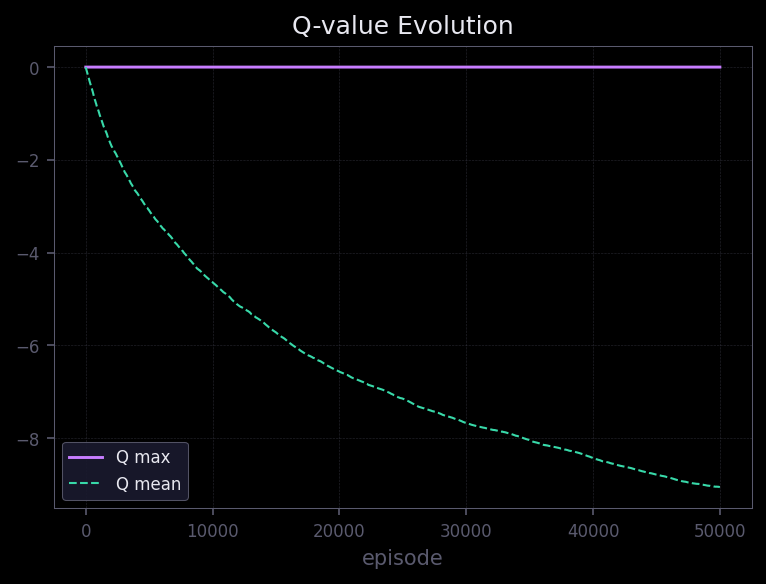

- The mean Q-value steadily decreases across all 50,000 episodes, reaching approximately -9 by the end.
- This is expected behavior in this environment, where rewards are predominantly negative (step penalties), so learned values naturally drift negative as the agent accumulates more accurate long-horizon estimates.
- The agent is effectively learning to minimize cumulative penalties - i.e., reach the goal in fewer steps.
- However, the fact that the mean Q-value shows no sign of leveling off is a mild concern. Ideally, Q-values should converge as the policy stabilizes. 
- The continued decline may indicate the value estimates are still being refined, which is consistent with the reward curve not yet plateauing either.
- The max Q-value remaining near zero throughout training suggests:

    - rewards are sparse or entirely non-positive,
    - and the agent rarely encounters states associated with strongly positive outcomes.

#### TD Error (per step)

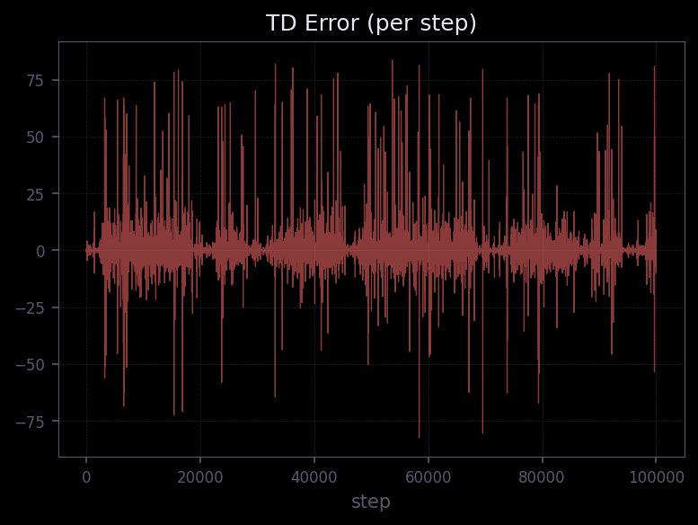

- The TD error is highly noisy throughout, which is typical in tabular or semi-gradient Q-learning settings.
- Crucially, it remains bounded and centered around zero with no visible upward drift or structural divergence - occasional spikes reach &plusmn; 75-85, but these are transient.
- This indicates:

    - stable learning updates across 100,000+ steps,
    - and no divergence in value estimates - the Bellman updates are well-behaved.


Overall, while the learning is noisy (as expected), the signals collectively indicate that the agent is **learning meaningful behavior**.


## Evaluating the trained model

After training, I used the learned policy to evaluate performance on the task. Below are some recorded runs of the Acrobot using the trained Q-learning model.

### Best runs (sorted by steps to reach the goal)

These are some of the more efficient trajectories, where the agent reaches the goal relatively quickly.

<p align="center">
  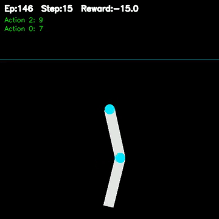
  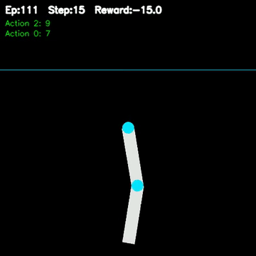
  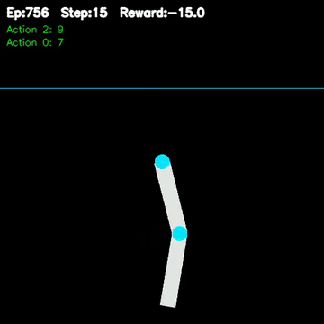
</p>

<p align="center">
  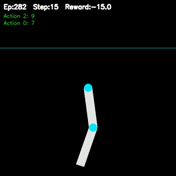
  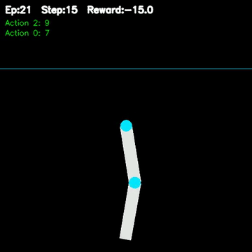
  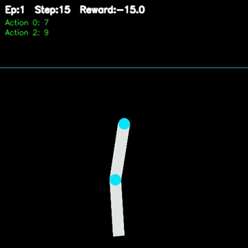
</p>

---

### Worst runs

These are cases where the agent struggles - either taking too long or failing to build sufficient momentum.

<p align="center">
  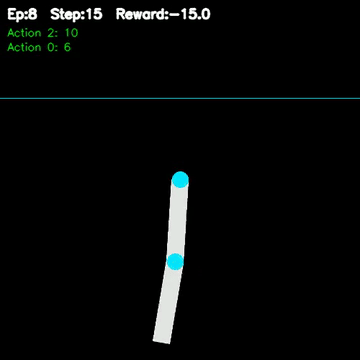
  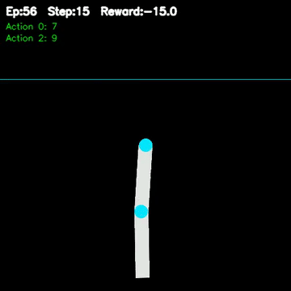
  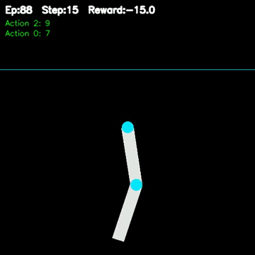
</p>

## Testing at scale

To better understand the model's overall performance, I ran it for **1 million episodes** and analyzed the distribution of steps taken to reach the goal.

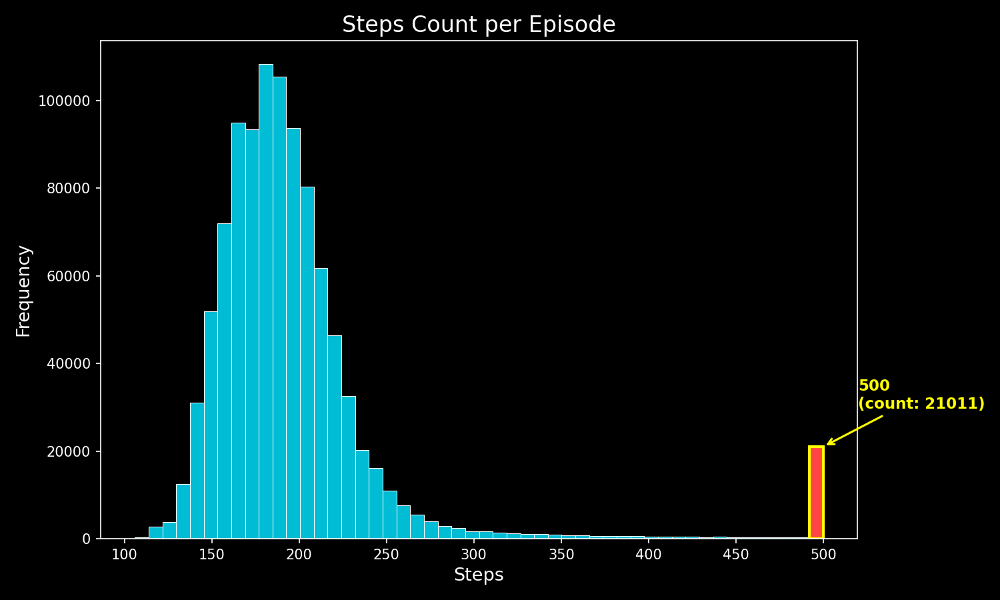

### Observations

* A large portion of episodes cluster in the **lower step range**, indicating that the agent often reaches the goal efficiently.
* However, about **2.1% of episodes hit the maximum limit of 500 steps**.

  * These are failure cases where:

    * the agent either fails to reach the goal
    * or reaches it too late (near the step limit)
* This suggests that while the policy is generally effective, it is **not fully robust**.

The model is clearly learning and improving, but it hasn't fully converged to an optimal policy. The presence of both strong runs and clear failures highlights a common trade-off in discretized Q-learning:

> **Good enough to work - but not perfect due to limited resolution and generalization.**


## My Closing thoughts on this solution

Looking back, what initially felt like a straightforward Q-learning problem turned into a lesson in **state representation and practicality**.

The biggest mistake I made early on wasn't in the learning algorithm-it was in how I chose to represent the state space. Moving from extremely fine discretization to a more constrained and thoughtful binning made the problem go from *completely infeasible* to something I could actually train and iterate on.

That shift-thinking less about "maximum precision" and more about **where precision actually matters**-made all the difference.

At the same time, this setup still has clear limitations:

* the learning is noisy
* performance is inconsistent in some cases
* and the model doesn't generalize particularly well

So while this works, it's not something I'd consider a complete solution.

The next step from here is fairly clear to me:

* move beyond hard discretization
* reduce reliance on manual binning
* and let the model learn a better representation of the state space

As for this solution, it serves as a **baseline**-a reference point to compare against other approaches I'll explore next for solving the same problem.